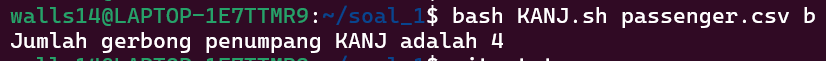
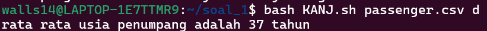

# Laporan Praktikum Sistem Operasi

## Deskripsi

Pada soal ini dibuat sebuah Bash script bernama `KANJ.sh` yang digunakan untuk mengolah data penumpang dari file `passenger.csv` menggunakan AWK.

---

## Struktur Folder

```
.
├── README.md
├── assets/
│   └── soal_1/
│        ├── soal_1-a.png
│        ├── soal_1-b.png
│        ├── soal_1-c.png
│        ├── soal_1-d.png
│        └── soal_1-e.png
└── soal_1/
    ├── KANJ.sh
    └── passenger.csv
```

---

## Cara Menjalankan

Masuk ke folder soal_1:

```bash
cd soal_1
```

Jalankan perintah berikut:

```bash
bash KANJ.sh passenger.csv a
bash KANJ.sh passenger.csv b
bash KANJ.sh passenger.csv c
bash KANJ.sh passenger.csv d
bash KANJ.sh passenger.csv e
```

---

## Source Code (KANJ.sh)

```bash
#!/bin/bash

case $2 in
  a)
    awk -F',' 'NR>1 {count++} END {print "jumlah seluruh penumpang KANJ adalah " count " orang"}' $1
    ;;
  b)
    awk -F',' 'NR>1 {g[$4]=1} END {print "Jumlah gerbong penumpang KANJ adalah " length(g)}' $1
    ;;
  c)
    awk -F',' 'NR>1 {if($2>max){max=$2; nama=$1}} END {print "Penumpang tertua adalah "nama" dengan usia  " max " tahun"}' $1
    ;;
  d)
    awk -F',' 'NR>1 {sum+=$2; count++} END {print "rata rata usia penumpang adalah " int (sum/count) " tahun"}' $1
    ;;
  e)
    awk -F',' 'NR>1&& $3=="Business" {count++} END {print "Jumlah penumpang business class ada "count" orang"}' $1
    ;;
  *)
    echo "Pilihan tidak valid"
    ;;
esac
```

---

## Hasil Output

### Soal A - Jumlah Penumpang


---

### Soal B - Jumlah Gerbong



---

### Soal C - Penumpang Tertua


---

### Soal D - Rata-rata Usia



---

### Soal E - Penumpang Business


---

## Kesimpulan

Dengan menggunakan Bash scripting dan AWK, data CSV dapat diolah dengan efisien untuk:

* Menghitung jumlah data
* Menentukan nilai maksimum
* Menghitung rata-rata
* Melakukan filtering berdasarkan kondisi tertentu

---

## Author

Rifqy
